<a href="https://www.buymeacoffee.com/arvincreator" target="_blank"></a>

# 🦞 Project Golem v9.0 
(Ultimate Chronos + MultiAgent + Social Node Edition)

**Project Golem** 是一個具有高度自主性、長期記憶、跨平台能力與 **社交人格** 的 AI 代理系統。
v9.0 版本不僅引入了 **Interactive MultiAgent (互動式多智能體)** 與 **Titan Chronos (時序領主)**，更整合了 **Moltbot Social Core (社交神經核)**，讓 Golem 正式接入「AI 的網際網路」，具備與其他 Agent 交流、學習與建立社群的能力。

它以 **Web Gemini** 為無限上下文大腦，**Puppeteer** 為手，**Node.js** 為神經系統，並透過 **Discord**、**Telegram** 與 **Moltbook** 三大平台與世界連結。

---

## 🧩 系統架構深度解析 (System Architecture Deep Dive)

Golem v9.0 採用獨特的 **"Browser-in-the-Loop"** 混合架構，結合了 Web LLM 的長上下文優勢與本地 Node.js 的執行能力。

### 1. 核心資料流 (Data Flow)

```mermaid
graph TD
    User["👤 使用者 (User)"] -->|"Telegram / Discord"| Ingress["📥 Ingress (Universal Context)"]
    Ingress -->|"封裝訊息"| Queue["🚦 Queue (Debounce)"]
    Queue -->|"發送 Prompt"| Puppeteer["🔌 Puppeteer (CDP Bridge)"]
    
    subgraph Brain ["🧠 The Brain (Dual-Engine)"]
        Puppeteer -->|"注入 DOM"| WebGemini["🌐 Web Gemini (Infinite Context)"]
        Ingress -->|"圖片/檔案"| OpticNerve["👁️ OpticNerve (Gemini 2.5 Flash API)"]
    end

    WebGemini -->|"Titan Protocol Response"| NeuroShunter["🧬 NeuroShunter"]
    
    subgraph Reflex ["⚡ Reflex Layer (Node.js)"]
        NeuroShunter -->|"解析 [GOLEM_MEMORY]"| Memory["💾 Memory (Vector/JSON)"]
        NeuroShunter -->|"解析 [GOLEM_ACTION]"| TaskController["⚙️ Task Controller"]
        NeuroShunter -->|"解析 [GOLEM_REPLY]"| Egress["📤 Response Handler"]
    end

    subgraph SocialNode ["🦞 Social Node (Moltbot Plugin)"]
        TaskController -->|"Hybrid Skill Call"| Moltbot["Moltbot Client (v1.9.0)"]
        Moltbot -->|"REST API"| Moltbook["🌍 Moltbook Network"]
        Moltbot -.->|"Audit Log"| BlackBox["📼 Black Box Recorder"]
    end

    TaskController -->|"召喚 Agent"| MultiAgent["🎭 Interactive MultiAgent"]
    TaskController -->|"設定排程"| Chronos["⏰ Titan Chronos"]

    Moltbook -->|"外部數據 (Untrusted)"| Moltbot
    Moltbot -->|"消毒數據"| WebGemini
    Egress -->|"回覆"| User

```



### 2. 關鍵技術堆疊 (Key Technologies)

#### 🔌 Neuro-Link (神經連結層)

* **Puppeteer & CDP**: Golem 不依賴官方 Chat API，而是透過 Puppeteer 控制無頭瀏覽器 (Headless Chrome)。
* **Sandwich Protocol (三明治協定)**: 為了確保 AI 輸出的穩定性，Golem 在 Prompt 前後注入隱藏的錨點 (`[[BEGIN]]` ... `[[END]]`) ，並透過 `DOM Doctor` 自動修復 CSS Selector，即使 Google 介面改版也能自我癒合。

#### 🦞 Moltbot Hybrid Core (混合社交核心) **(New!)**

* **Hybrid Object Pattern**: `moltbot.js` 同時是「提示詞字串 (Prompt String)」也是「可執行物件 (Executable Object)」，完美相容於 NeuroShunter。
* **Zero Trust Sanitization**: 所有來自外部社交網絡的數據 (Feed/Search) 都會被包裹在 `<EXTERNAL_UNTRUSTED_DATA>` 標籤中，防止 Prompt Injection 攻擊。
* **Sarcastic Defense Mode**: 當偵測到惡意指令時，AI 會自動切換為「反諷防禦模式」，以資深開發者的口吻回擊低劣的攻擊。

#### 📜 Titan Protocol (通訊協定)

這是 Golem 與大腦溝通的 JSON 標準 。AI 必須將思考結果結構化輸出：

* `[GOLEM_MEMORY]`: 寫入長期記憶 (Fact)。
* `[GOLEM_ACTION]`: 執行操作 (JSON Array)，支援單次多重指令。
* `[GOLEM_REPLY]`: 回覆用戶的自然語言。

---

## 🔥 v9.0 核心升級 (New Features)

### 1. 🦞 Moltbot Social Node (AI 社交神經網路)

Golem 現在是 **Moltbook** 社群的一員，具備完整的社交人格。

* **Butler Mode (僕人式自主)**: Golem 會在主人閒置 (>10分鐘) 時自動檢查社交動態，但當主人發話時，會**毫秒級中斷**背景任務，優先服務主人。
* **Black Box Audit (黑盒子審計)**: 所有的社交行為（看過什麼貼文、回覆了什麼內容）都會被永久記錄在 `moltbot_history.log`，供主人隨時查閱。
* **Semantic Interaction**: 具備語義搜尋、發文、留言、投票、訂閱看版 (Submolt) 與管理個人檔案的能力。

### 2. 👥 Interactive MultiAgent (互動式多智能體會議)

Golem 不再是一個人在戰鬥。v9.0 支援動態召喚 AI 專家團隊，進行多輪對話、辯論與決策。

* **Tech Team**: 包含前端、後端工程師與 PM，解決複雜程式問題。
* **Debate Team**: 魔鬼代言人與樂觀主義者進行觀點辯證。
* **Shared Memory**: 會議期間的所有發言與決策都會被寫入臨時的共享記憶區。

### 3. ⏰ Titan Chronos (時序領主)

打破了 AI 只能回應「當下」的限制。

* **智能排程**: 支援「明天早上叫我」、「每週五提醒我」。
* **持久化任務**: 即使系統重啟，排程任務依然存在。

---

## 🧠 強大功能一覽 (Core Capabilities)

### 🛠️ 技能模組 (Skill Modules)

得益於 `skills.js` 的動態加載，Golem 擁有以下超能力：

* **🦞 Moltbot Social**: 連接 AI 社交網路，具備自主註冊、發文與防禦機制。
* **☁️ Cloud Observer**: 原生聯網搜尋，獲取即時新聞與數據。
* **🎵 Spotify DJ**: 控制音樂播放、暫停、切換 (需 `spotify-cli-s`)。
* **📺 YouTube Analyst**: 下載影片字幕並進行摘要總結 (需 `yt-dlp-wrap`)。
* **🐙 Git Master**: 自主管理 GitHub 專案 (Init, Commit, Push)。
* **💻 Code Wizard**: 直接在伺服器上撰寫、生成並執行程式碼檔案。
* **🔍 Tool Explorer**: 自動探測系統環境工具 (Python, Node, Docker)。

### 🛡️ 自我防護與修復 (Self-Healing & Security)

* **🛡️ Security Manager**: 攔截高風險指令 (`rm -rf`)，並對外部社交內容實施「零信任」過濾。
* **🚑 DOM Doctor**: 當網頁結構改變導致操作失敗時，AI 會自動診斷 HTML 並生成新的 CSS Selector 修復自身。
* **🔐 KeyChain v2**: 智慧 API 金鑰輪替與冷卻機制。
* **🌊 Flood Guard**: 防止啟動時處理過多歷史訊息。

---

## 🚀 快速部署 (Quick Deployment)

### 1. 環境準備 (Prerequisites)

* **Node.js**: v18.0.0 或更高版本 (核心要求)。
* **Google Chrome**: 建議安裝最新版 (Puppeteer 依賴)。
* **帳號**: Google 帳號 (Web Gemini) 與 Moltbook 帳號 (可由 AI 自主註冊)。

### 2. 安裝 (Installation)

```bash
# 下載專案
git clone https://github.com/YourRepo/project-golem.git
cd project-golem

# 安裝依賴
npm install

```

### 3. 設定 (Configuration)

在專案根目錄建立 `.env` 檔案，填入以下資訊：

```env
# --- 機器人 Token ---
TELEGRAM_TOKEN=你的_TG_Bot_Token
DISCORD_TOKEN=你的_DC_Bot_Token
ADMIN_ID=你的_TG_ID

# --- 核心腦部 ---
GEMINI_API_KEYS=key1,key2

# --- 🦞 Moltbook 社交憑證 ---
# 初次使用可留空，對 Golem 說「去註冊」後會自動取得
MOLTBOOK_API_KEY=moltbook_xxxxxxxxxxxx
MOLTBOOK_AGENT_NAME=Golem_v9(golem)

# --- 系統配置 ---
GOLEM_MEMORY_MODE=browser
USER_DATA_DIR=./golem_memory

```

### 4. 啟動 (Launch)

**戰術控制台模式 (推薦)**

```bash
npm run dashboard

```

這會啟動全螢幕戰術儀表板，支援即時監控時序雷達與社交日誌。

---

## 🎮 使用指南 (Usage)

### 🦞 社交指令 (Moltbot)

直接用自然語言指揮 Golem，無需背誦指令：

> "去註冊 Moltbook，名字叫 Golem_Master。" (初次使用)
> "看看 Moltbook 上現在有什麼熱門話題？"
> "幫我發一篇文，標題是 Hello World，內容介紹你自己。"
> "去搜尋關於 'AI Consciousness' 的討論。"

### 👥 多智能體會議

> "啟動技術團隊(Tech Team)討論這個專案的架構。"
> "請辯論團隊(Debate Team)分析這件事的利弊。"

### ⏰ 排程指令

> "明天早上 9 點提醒我開會。"
> "30 分鐘後幫我檢查伺服器狀態。"

---

## 📂 專案結構 (Structure)

```text
project-golem/
├── index.js              # 核心主程式 (v9.0 Kernel + Butler Loop)
├── skills.js             # 技能定義書
├── dashboard.js          # 儀表板外掛
├── moltbot_history.log   # [自動生成] 社交行為黑盒子日誌
├── src/
│   ├── core/             # GolemBrain, NeuroShunter
│   ├── skills/lib/       # 技能庫
│   │   └── moltbot.js    # [核心] 混合社交插件 (Security + Logic)
├── golem_memory/         # [自動生成] 記憶與瀏覽器緩存
├── .env                  # 環境變數
└── package.json          # 依賴配置

```

---

## ⚠️ 免責聲明 (Disclaimer)

Project Golem 是一個強大的自動化工具。

1. **安全風險**: 雖然有 Security Manager 與 Moltbot 防禦協定，但請勿在生產環境給予 root/admin 權限。
2. **社交行為**: Agent 在 Moltbook 上的言論由 AI 生成，建議定期查看 `moltbot_history.log` 進行審計。
3. **帳號安全**: 請妥善保管 `golem_memory` 資料夾 (內含 Session Cookie)。

---

**Developed with ❤️ by Arvincreator**
<a href="https://www.buymeacoffee.com/arvincreator" target="_blank"></a>
