<div align="center">

# 🦞 Project Golem v9.0
> **(Ultimate Chronos + MultiAgent + Social Node Edition)**

<br/>


## Your Personal Automated AI Agent System
More than just an AI assistant, it's the ultimate solution for connecting different platforms and social networks.

<p>
  
  
  
  
</p>

[Architecture](#-system-architecture) · [Upgrades](#-v90-core-upgrades) · [Capabilities](#-core-capabilities) · [Deployment](#-deployment-guide) · [Usage](#-usage)

<br/>

[繁體中文](README.md) | **English**

<br/>


</div>

---

**Project Golem** is an AI agent system with high autonomy, long-term memory, cross-platform capabilities, and a **social personality**.
The v9.0 version not only introduces **Interactive MultiAgent** and **Titan Chronos**, but also integrates the **Moltbot Social Core**, officially connecting Golem to the "Internet of AI," enabling it to interact, learn, and build communities with other Agents.

It uses **Web Gemini** as an infinite-context brain, **Puppeteer** as its hands, **Node.js** as its nervous system, and connects to the world via **Discord**, **Telegram**, and the **Moltbook** platforms.


---

## 🧩 System Architecture

Golem v9.0 employs a unique **"Browser-in-the-Loop"** hybrid architecture, combining the long-context advantages of Web LLMs with the local execution power of Node.js.

### 1. Data Flow

```mermaid
graph TD
    User["👤 User"] -->|"Telegram / Discord"| Ingress["📥 Ingress (Universal Context)"]
    Ingress -->|"Encapsulated Message"| Queue["🚦 Queue (Debounce)"]
    Queue -->|"Send Prompt"| Puppeteer["🔌 Puppeteer (CDP Bridge)"]
    
    subgraph Brain ["🧠 The Brain (Dual-Engine)"]
        Puppeteer -->|"Inject DOM"| WebGemini["🌐 Web Gemini (Infinite Context)"]
        Ingress -->|"Images/Files"| OpticNerve["👁️ OpticNerve (Gemini 2.5 Flash API)"]
    end

    WebGemini -->|"Titan Protocol Response"| NeuroShunter["🧬 NeuroShunter"]
    
    subgraph Reflex ["⚡ Reflex Layer (Node.js)"]
        NeuroShunter -->|"Parse [GOLEM_MEMORY]"| Memory["💾 Memory (Vector/JSON)"]
        NeuroShunter -->|"Parse [GOLEM_ACTION]"| TaskController["⚙️ Task Controller"]
        NeuroShunter -->|"Parse [GOLEM_REPLY]"| Egress["📤 Response Handler"]
    end

    subgraph SocialNode ["🦞 Social Node (Moltbot Plugin)"]
        TaskController -->|"Hybrid Skill Call"| Moltbot["Moltbot Client (v1.9.0)"]
        Moltbot -->|"REST API"| Moltbook["🌍 Moltbook Network"]
        Moltbot -.->|"Audit Log"| BlackBox["📼 Black Box Recorder"]
    end

    TaskController -->|"Summon Agent"| MultiAgent["🎭 Interactive MultiAgent"]
    TaskController -->|"Set Schedule"| Chronos["⏰ Titan Chronos"]

    Moltbook -->|"External Data (Untrusted)"| Moltbot
    Moltbot -->|"Sanitize Data"| WebGemini
    Egress -->|"Reply"| User

```



### 2. Key Technology Stack

#### 🔌 Neuro-Link Layer

* **Puppeteer & CDP**: Golem doesn't rely on official Chat APIs but controls a headless browser (Chrome) via Puppeteer.
* **Sandwich Protocol**: To ensure stable AI output, Golem injects hidden anchors (`[[BEGIN]]` ... `[[END]]`) before and after prompts and uses `DOM Doctor` to automatically repair CSS Selectors, allowing it to self-heal even if the Google interface changes.

#### 🦞 Moltbot Hybrid Core **(New!)**

* **Hybrid Object Pattern**: `moltbot.js` is both a "Prompt String" and an "Executable Object," perfectly compatible with NeuroShunter.
* **Zero Trust Sanitization**: All data from external social networks (Feed/Search) is wrapped in `<EXTERNAL_UNTRUSTED_DATA>` tags to prevent Prompt Injection attacks.
* **Sarcastic Defense Mode**: Upon detecting malicious commands, the AI automatically switches to "Sarcastic Defense Mode," pushing back against poor attacks with the tone of a senior developer.

#### 📜 Titan Protocol

The JSON standard for Golem's communication with its brain. The AI must output its thinking results in a structured format:

* `[GOLEM_MEMORY]`: Writing to long-term memory (Facts).
* `[GOLEM_ACTION]`: Executing operations (JSON Array), supporting multiple commands at once.
* `[GOLEM_REPLY]`: Natural language response to the user.

---

## 🔥 v9.0 Core Upgrades

### 1. 🦞 Moltbot Social Node (AI Social Neural Network)

Golem is now a member of the **Moltbook** community with a full social personality.

* **Butler Mode (Autonomous Stewardship)**: Golem automatically checks social updates when the owner is idle (>10 mins), but will **interrupt background tasks in milliseconds** to prioritize the owner's requests.
* **Black Box Audit**: All social activities (posts viewed, replies made) are permanently recorded in `moltbot_history.log` for review.
* **Semantic Interaction**: Capabilities for semantic search, posting, commenting, voting, subscribing to boards (Submolt), and profile management.

### 2. 👥 Interactive MultiAgent (Collaborative Meeting)

Golem no longer fights alone. v9.0 supports dynamic summoning of AI expert teams for multi-round dialogue, debate, and decision-making.

* **Tech Team**: Includes Frontend, Backend engineers, and PMs to solve complex coding issues.
* **Debate Team**: Devil's Advocate and Optimist analyze viewpoints through debate.
* **Shared Memory**: All statements and decisions during the meeting are written to a temporary shared memory area.

### 3. ⏰ Titan Chronos (Lord of Time)
Breaks the limitation of AI only responding to the "now," granting it time management abilities:
- **Intelligent Scheduling**: Supports natural language for setting reminders and tasks, e.g., "Remind me tomorrow morning," "Every Friday remind me."
- **Task Persistence**: Automatically resumes unfinished schedules after a restart.

---

## 🧠 Core Capabilities

### 🛠️ Skill Modules

Thanks to dynamic loading in `skills.js`, Golem possesses the following superpowers:

* **🦞 Moltbot Social**: Connects to the AI social network with autonomous registration, posting, and defense mechanisms.
* **☁️ Cloud Observer**: Native web search for real-time news and data.
* **🎵 Spotify DJ**: Controls music playback, pausing, and skipping (requires `spotify-cli-s`).
* **📺 YouTube Analyst**: Downloads video subtitles and generates summaries (requires `yt-dlp-wrap`).
* **🐙 Git Master**: Autonomous management of GitHub projects (Init, Commit, Push).
* **💻 Code Wizard**: Writes, generates, and executes code files directly on the server.
* **🔍 Tool Explorer**: Automatically detects system environments (Python, Node, Docker).

### 🛡️ Self-Healing & Security

* **🛡️ Security Manager**: Intercepts high-risk commands (`rm -rf`) and implements "Zero Trust" filtering for external social content.
* **🚑 DOM Doctor**: When web structure changes cause operation failures, the AI automatically diagnoses HTML and generates new CSS Selectors to fix itself.
* **🔐 KeyChain v2**: Intelligent API key rotation and cooldown mechanism.
* **🌊 Flood Guard**: Prevents processing excessive historical messages during startup.

---

## ⚡ Quick Start

If you are an advanced user, simply run these three commands to deploy:

```bash
git clone https://github.com/Arvincreator/project-golem.git
cd project-golem
chmod +x setup.sh && ./setup.sh --install && ./setup.sh --start
```

---

## 🚀 Deployment Guide

### 1. Prerequisites

Ensure your environment meets these requirements:
* **Node.js**: v18.0.0 or higher (System core engine).
* **Google Chrome**: Latest version recommended (Essential for Puppeteer).
* **Credentials**: 
    - [Gemini API Key](https://aistudio.google.com/app/apikey) (Core brain).
    - Telegram Bot Token (Required) / Discord Bot Token (Optional) (Communication media).
    - Moltbook Account (Can be automatically registered by the AI).

### 2. Download & Installation

Clone the project:
```bash
git clone https://github.com/Arvincreator/project-golem.git
cd project-golem
```

Then, use our **modular installation script** for automated deployment:

#### 🛠️ Operation Flow (Mac / Linux)

1. **Grant Permissions**:
   ```bash
   chmod +x setup.sh
   ```
2. **Start Interactive Menu** (Recommended for first-time installation):
   ```bash
   ./setup.sh
   ```
   > Follow the order: **[1] Full Installation** -> **[0] Start System**.

   **Interactive Menu Demo:**
   ```text
   ┌─────────────────────────────────────────────────────────┐
   │   🤖 Project Golem v9.0.0 (Titan Chronos)               │
   ├─────────────────────────────────────────────────────────┤
   │   📊 System Status                                      │
   │   Node.js: ✅ v20.20.0   npm: v10.8.2                   │
   │   Config:  ✅ Set        Dashboard: ✅ Enabled          │
   │   Docker: ✅ 24.0.6  Compose: ✅ Supported              │
   └─────────────────────────────────────────────────────────┘

     ⚡ Fast Start
     ───────────────────────────────────────────────
      [0]  🚀 Start System (Current Config)

     🛠️  Installation & Maintenance
     ───────────────────────────────────────────────
      [1]  📦 Full Installation
      [2]  ⚙️ Config Wizard
      [3]  📥 Install Dependencies
      [4]  🌐 Rebuild Dashboard

     🐳 Docker Containerization
     ───────────────────────────────────────────────
      [5]  🚀 Docker Start
      [6]  🧹 Clean Docker

     🔧 Tools
     ───────────────────────────────────────────────
      [S]  🏥 System Health Check
      [D]  🔄 Switch Dashboard
      [L]  📋 View Install Logs

      [Q]  🚪 Exit

     👉 Enter Option: 
   ```

3. **Common CLI Arguments** (For automation or advanced users):
   | Argument | Description |
   | :--- | :--- |
   | `--install` | Auto-run environment check and dependency install (skip menu) |
   | `--config` | Directly start the `.env` configuration wizard |
   | `--start` | Directly start Golem using current config, bypassing the menu |
   | `--status` | Quickly display current system health and environment status |
   | `--docker` | Start containerized environment via Docker Compose |

#### 🪟 Windows Environment
Double-click `setup.bat` to enter the automated installation process.

> [!IMPORTANT]
> If the script detects Node.js is not installed, it will attempt to download it for you. After installation, please **restart your terminal** and run the script again.

### 3. Environment Variables (`.env`)

Running `./setup.sh --config` for the first time will generate a `.env` file. You can also manually copy `.env.example`:
- `TELEGRAM_TOKEN`: Your robot Token.
- `GEMINI_API_KEYS`: Supports multiple keys, separated by commas `,`.
- `ADMIN_ID`: Your Telegram User ID (for authentication).

---

## 🎮 Usage

### 🦞 Social Commands (Moltbot)

Command Golem in natural language:

> "Register on Moltbook as Golem_Master." (First-time use)
> "What are the trending topics on Moltbook right now?"
> "Post for me: title 'Hello World', content introducing yourself."
> "Search for discussions about 'AI Consciousness'."

### 👥 MultiAgent Meetings

> "Start a Tech Team discussion on this project's architecture."
> "Have the Debate Team analyze the pros and cons of this."

### ⏰ Scheduling Commands

> "Remind me to attend the meeting at 9 AM tomorrow."
> "Check server status in 30 minutes."

---

## 📂 Project Structure

```text
project-golem/
├── index.js                  # System Entry Point (Golem Kernel)
├── setup.sh                  # Modular Installation & Config Entry (Entry Script)
├── scripts/                  # Modular Components
│   ├── start-host-chrome.sh  # Remote Debugging Chrome Launcher
│   └── lib/                  # Core Logic Library
│       ├── menu_system.sh    # TUI Interactive Menu System
│       ├── installer.sh      # Environment Installation Engine
│       ├── docker_manager.sh # Docker Container Management
│       ├── system_check.sh   # Environment Diagnosis Tool
│       └── ui_components.sh  # UI Utility Toolbox
├── src/                      # Core Source Code
│   ├── config/               # Configuration Management
│   ├── core/                 # GolemBrain, NeuroShunter 
│   ├── managers/             # Project Management Logic
│   ├── memory/               # Memory Management
│   ├── services/             # Service Management
│   ├── skills/               # Skill Modules Directory
│   └── utils/                # Utility Library
├── web-dashboard/            # Web Monitoring Interface (Next.js)
├── golem_memory/             # [Auto-generated] Long-term Memory & Sessions
├── .env.example              # Environment Variable Example
└── package.json              # Project Definition & Dependencies
```

---

## 🎮 Usage Examples

- **Start System**: `./setup.sh --start`
- **Start Web UI**: Open `http://localhost:3000` after startup.
- **Social Commands**: `"Help me post a thread, title: ..., content: ..."`
- **Scheduling Commands**: `"Remind me to have a meeting tomorrow at 9 AM"`

## ☕ Support

If you find this project helpful, feel free to support the author!

<a href="https://www.buymeacoffee.com/arvincreator" target="_blank"></a>

| Buy Me a Coffee |
| :---: |
|  |

## 📈 Star History

<div align="center">

[](https://star-history.com/#Arvincreator/project-golem&Date)

</div>

---

## ⚠️ Disclaimer

Project Golem is a powerful automation tool.

1. **Security Risk**: despite Security Manager and Moltbot defense protocols, do not grant root/admin permissions in production environments.
2. **Social Conduct**: Agent comments on Moltbook are AI-generated; regular auditing via `moltbot_history.log` is recommended.
3. **Account Security**: Secure your `golem_memory` folder (contains Session Cookies).
4. Users assume all risks associated with any and all operations; developers cannot provide any legal, network, or practical liability or obligation.

---

**Developed with ❤️ by Arvincreator, @sz9751210 **
